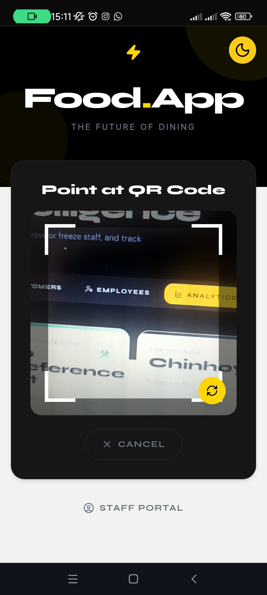
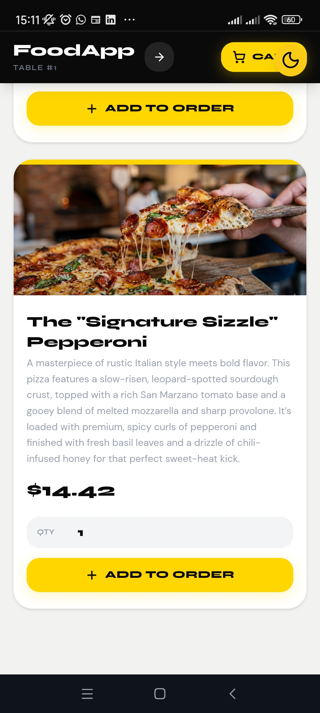
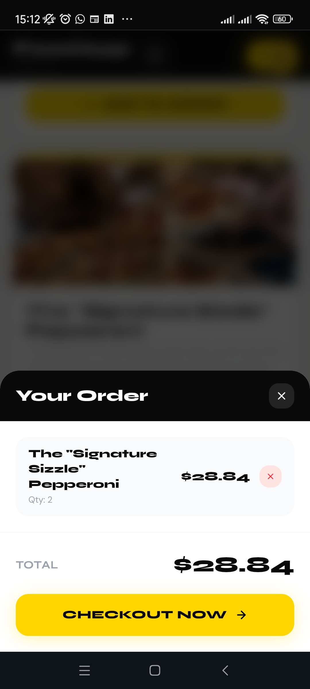
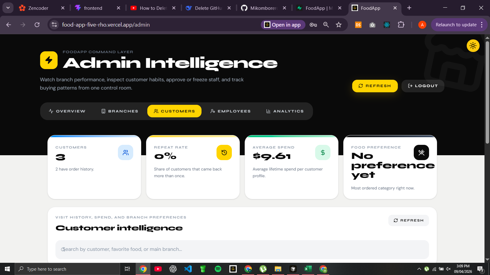
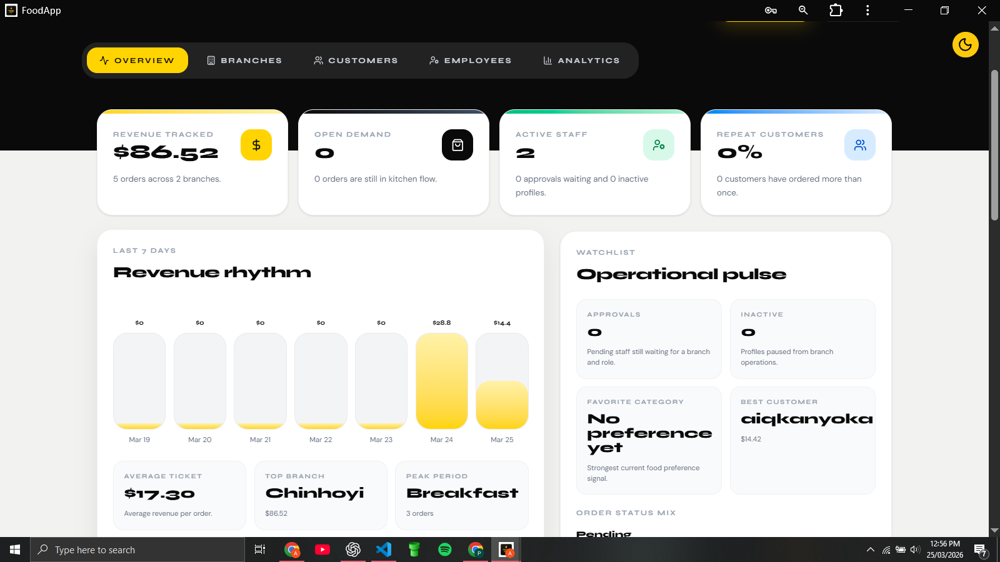

# QR Restaurant Ordering System 🍽️

A QR-based restaurant ordering system that allows customers to scan, browse menus, and place orders directly from their phones—no app installation required.

---

## ❗ Problem

Traditional restaurant ordering systems rely on waiters and physical menus, which can cause:

- Slow service during busy hours  
- Order mistakes due to manual input  
- Poor customer experience  
- Hygiene concerns with shared menus  

---

## 💡 Solution

This system allows customers to:

- Scan a QR code at their table  
- Instantly access a digital menu  
- Place orders directly from their phone  

For restaurants, this means:

- Faster order processing  
- Fewer errors  
- Reduced workload for staff  
- Better customer experience  

---

## ⚙️ How It Works

1. Customer scans a QR code placed on their table  
2. The QR code opens the web app (no installation required)  
3. Customer browses the menu  
4. Items are added to cart with optional notes  
5. Order is submitted and stored in the database  
6. Restaurant receives and processes the order  
7. Customer gets order updates  

---

## ✨ Features

- 📱 PWA Support (installable on mobile)
- 🔗 QR Code-based ordering
- 📋 Digital menu with categories
- 🛒 Cart system with quantity & notes
- 💳 Online payment integration
- 👨‍💼 Admin dashboard for managing orders
- 📊 Real-time order tracking
- 🔔 Notifications for order updates

---

## 🧠 Key Highlights

- Built as a Progressive Web App (PWA) for app-like experience  
- Designed for fast, low-friction ordering  
- Uses Supabase for real-time backend and authentication  
- Mobile-first design for real restaurant environments  

---

## 🏗️ Tech Stack

**Frontend**
- JavaScript (ES6+)
- HTML/CSS (Responsive Design)
- PWA

**Backend & Database**
- Supabase (PostgreSQL, Auth, Storage)
- Row Level Security (RLS)

---

## 🚀 Live Demo

https://food-app-five-rho.vercel.app

---

## 📸 Screenshots

| **Scan** | **Menu** | **Cart** |
| :---: | :---: | :---: |
|  |  |  |

| **Admin Dashboard** | **Admin Analytics** |
| :---: | :---: |
|  |  |

---

## 📈 Business Impact

This system can help restaurants:

- Serve more customers faster  
- Reduce order errors  
- Improve customer experience  
- Modernize their operations  

---

## 🏪 Use Case

This system is ideal for:
- Restaurants with high customer traffic
- Cafés looking to modernize ordering
- Businesses wanting contactless service

---

## 🚧 Future Improvements

- Payment integration (Stripe, Paynow)
- Table-specific tracking

---

## 🛠️ Local Development

### Prerequisites
- Node.js
- npm or yarn
- Supabase account

### Installation

```bash
git clone https://github.com/Mikomborero-Kanyoka/qr-restaurant-ordering-system.git
cd qr-restaurant-ordering-system
npm install
npm run dev
```

## 👤 Author

Built by Mikomborero Kanyoka
